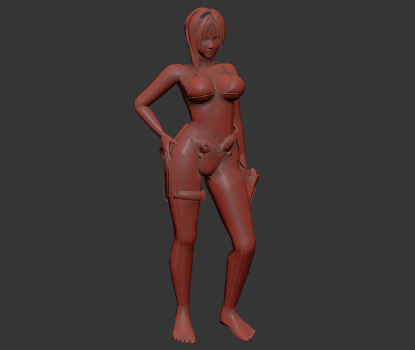

# AGA PC Model Importer for 3ds Max



This repository contains a MaxScript (`PC_AGA_Importer.ms`) for importing `.x` 3D model files from the old Illusion game **AGA** into Autodesk 3ds Max. This script allows users to load and visualize the game's models within 3ds Max for further editing or analysis.

## Features

- **Model Import**: Import `.x` model files from AGA into 3ds Max.
- **Geometry Support**: Handles vertices, faces, normals, and UV coordinates.
- **Material and Texture Parsing**: Reads material (`MATE`) and texture (`TEXT`) chunks.
- **Hierarchy Reconstruction**: Processes frame data to rebuild the model hierarchy.
- **Sample Assets**: Includes a sample `.x` file and preview image for testing.

## Requirements

- **Autodesk 3ds Max** (compatible with MaxScript)
- `.x` model files extracted from the AGA game

## Installation

1. **Clone or Download the Repository**

   ```bash
   git clone https://github.com/coreynguyen/mxs_illusion_aga_pc.git
   ```

2. **Locate the Script**

   Place the `PC_AGA_Importer.ms` file in a convenient location or your 3ds Max scripts directory.

3. **Extract Sample Files (Optional)**

   - Navigate to `assets/sample.zip` and extract its contents if you wish to test the script with the provided sample model.

## Usage

1. **Launch 3ds Max**

2. **Run the Script**

   - Go to `Scripting` > `Run Script...` in the 3ds Max menu.
   - Navigate to where you saved `PC_AGA_Importer.ms` and select it.

3. **Select a Model File**

   - A file dialog will appear. Navigate to your `.x` model file extracted from the AGA game.
   - Select the file and click `Open`.

4. **Import Process**

   - The script will process the selected `.x` file.
   - The imported model will appear in the 3ds Max viewport upon completion.

5. **Editing and Exploration**

   - You can now edit, texture, animate, or render the model within 3ds Max.

## Preview


*An example of a model imported using the script.*

## Sample File

A sample `.x` model file is provided in `assets/sample.zip`. Use this file to test the importer and see how the script handles AGA game models.

## Notes

- **Compatibility**: This script is specifically designed for the AGA game's `.x` files and may not work with other `.x` formats.
- **Scaling**: The script applies a scaling factor (`mscale = 10.0`) to the models. Adjust this value in the script if needed.
- **Limitations**: Currently, the script focuses on importing geometry and does not fully support animations or certain advanced features.

---

Feel free to contribute to this project by submitting issues or pull requests. Your feedback is appreciated!
